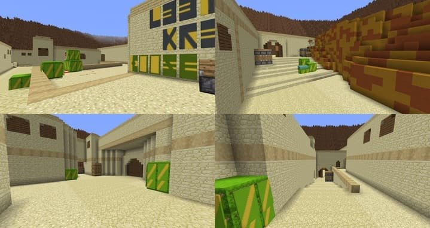

У цій статті **зібрані 3 популярні мапи з Counter-Strike 1.6**, які тепер портовані та доступні для гри на них у кубічному світі Minecraft PE (Bedrock). Ви зможете покликати своїх друзів, розділитись на команди та влаштувати шутер за допомогою моди на зброю, який ми показували раніше.
***
Навігація:   
* Особливості мап Локації з CS 1.6 
* Локація КС 1.6 Dust II 
* Локація КС 1.6 Nuke 
* Локація КС 1.6 Assault 
* Завантажити
***
# Особливості мап Локації з CS 1.6
  
Всі продемонстровані мапи в цій збірці дзеркально відображають дійсну місцевість та декорації з оригінальних локацій КС 1.6, які тепер будуть доступні для гри і в Майнкрафт ПЕ (Бідрок).
  
Не пропустіть момент зробити шутер зі змаганнями у світі з цими мапами разом зі своєю групою друзів, встановивши мод на військову зброю, після чого розділитися на дві команди гравців: спецназ і терористи.
***
# Локація КС 1.6 Dust II
  
Це найкультовіша та найголовніша мапа для стрілялок у Контр Страйк 1.6, яка тепер портована та доступна в Minecraft PE (Bedrock) для гри. Нижче представлені її скріншоти, декорації, що відображаються, і точна передача оригіналу всіх часів:
  

***
# Локація КС 1.6 Nuke

Локація з бомбовими майданчиками, що сповнені ядерних ракет, тепер також відповідає оригіналу і доступна після портування для проведення перестрілок на ній у Майнкрафт ПЕ (Бідрок). Оцініть ці скріншоти, що демонструють всю масштабність мапи:
